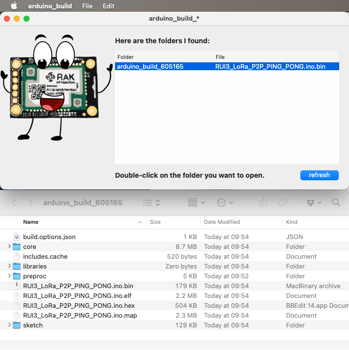

# arduino_build

A small app for Mac OS X that looks for Arduino IDE build folders (in the /private/var/folders/ area) and makes them easily accessible. Useful when uploading a firmware from outside Arduino IDE (JLink, STM32Cube Programmer, etc)

